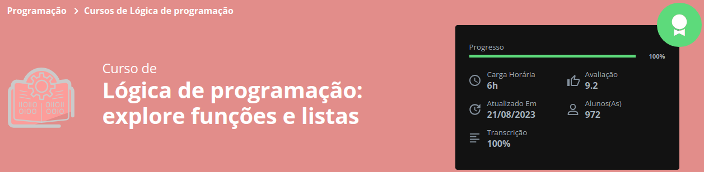

# Jogo do Número Secreto

## Descrição

-> Projeto realizado durante o curso de Lógica de Programação com JavaScript. O objetivo do projeto era criar um Jogo de Adivinhação, assim como o projeto anterior [https://github.com/nandoo96/Front-End/tree/main/FormacaoInicianteProgramacao-Alura/LogicaProgramacao-MergulheEmJavaScript], porém de forma mais 'funcional' evoluindo nas boas práticas e também no aprendizado da linguagem!

[Clique aqui para acessar o Jogo](https://game-two-liart.vercel.app/)

## Informações do Curso Concluído

