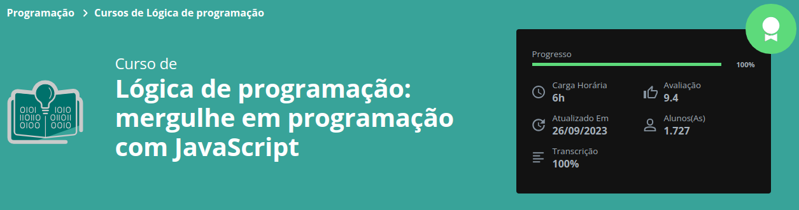

# Adivinhe o Número Secreto

## Objetivo do Projeto
- [x] Aprender a sintaxe básica do JavaScript
- [x] Práticar Lógica de Programação
    - Condicionais e Concatenação
    - Loops
    - Boas práticas

## Descrição

-> Neste projeto foi utilizado JavaScript para criar toda a parte lógica do Jogo.
O objetivo era criar um Jogo de Adivinhação, onde o sistema irá gerar um número aleatório dentro de um range pré-definido, e o usuário deverá tentar acertar o número secreto. A cada tentativa o sistema retorna dizendo se o número secreto é maior ou menor que o 'chute' do usuário, se o usuário acertar o sistema devolve o número e também a informação de quantas tentativas foram efetuadas!

## Informações do Curso Concluído

